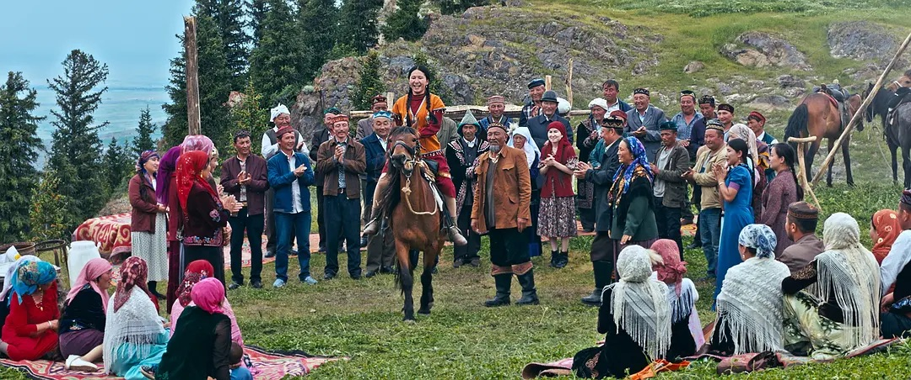

{full}

## Welcome to the digital exhibition _Kazakh Women’s Voices_ Genealogy of Women’s Literature and Thoughts from the 1970s to the present.
This digital exhibition traces how Xinjiang Kazakh women have expressed their lives and ideas from the 1970s to today. It brings together women’s writings, conversations, and drawings. This project explores how generations of Kazakh women have written and imagined their lives across socialism, modernization, and globalization. By connecting literature and digital media, I hope to build a living archive that makes their voices heard across time and place.
